### 1、打开apple官网，登录国区账号      使用gmail或outlook，  别用qq或163

[apple官网登录地址](https://account.apple.com/account/manage/section/information)

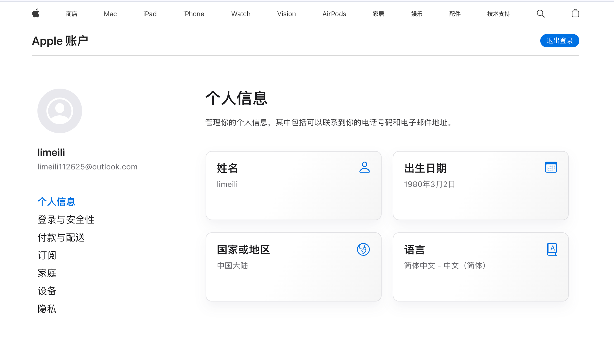

### 2、修改国家
点击修改**国家或地区**，选择美国
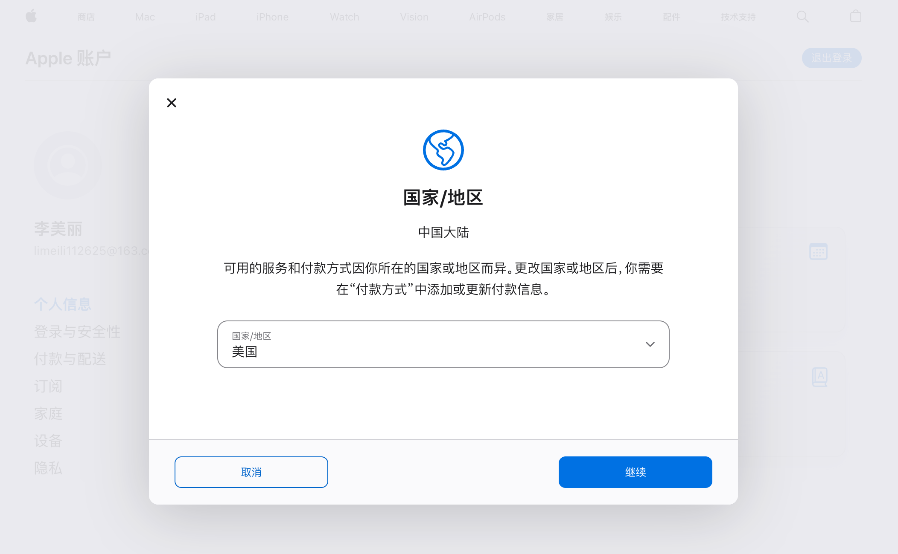

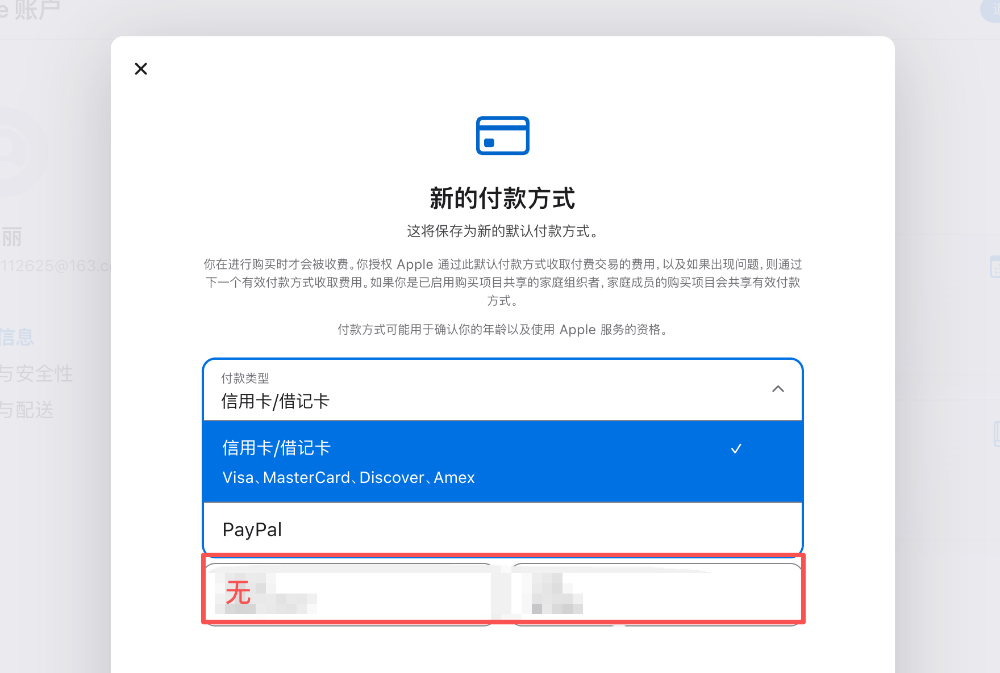

如果付款方式没有 【无】 这个选项，看步骤三，如果有可跳过3看4
### 3、更改mac上的地区

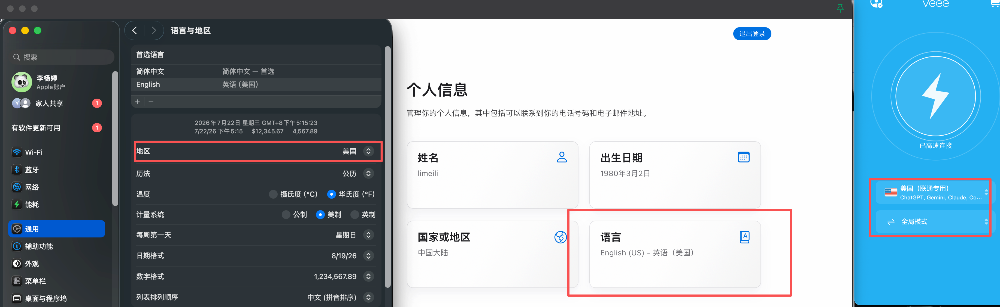

- 设置 - 通用 - 地区 - 美国
- Apple - 语言- English(us) 
- 🪜 - 美国 -全局模式

⚠️更改完未生效的话，可关机重启，或者这几项多次切换试试

### 4、付款方式

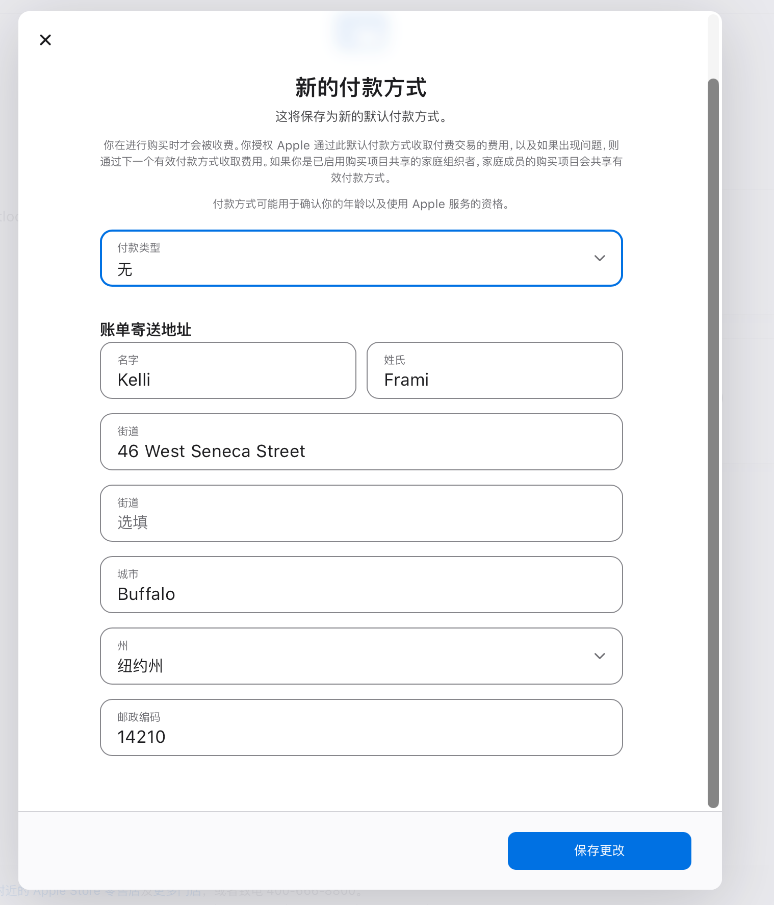

- 付款类型：无

- 账单地址：随机生成一个填进去就行

  [美国地址生成器](https://usaddressgen.com/)

- 这些填完后【保存更改】按钮不生效时，看**步骤5**，生效了跳5看6

### 5、[下载uu加速器](https://uu.163.com/)

如果在浏览器中无法保存账单时，需要下载UU加速器 ，加速App Store ,然后地区在App Store中修改，别再浏览器中修改了

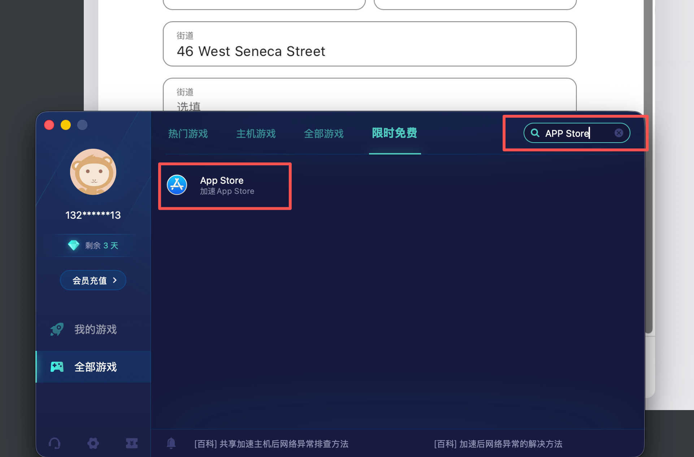

加速 App Store

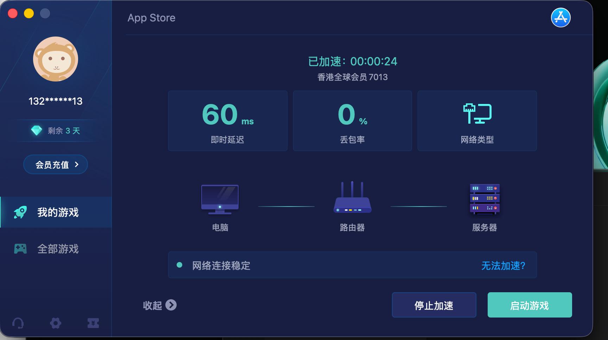

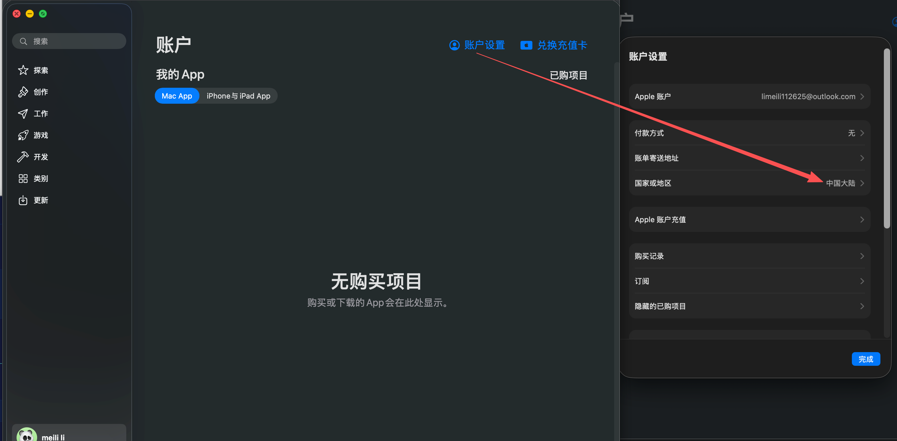

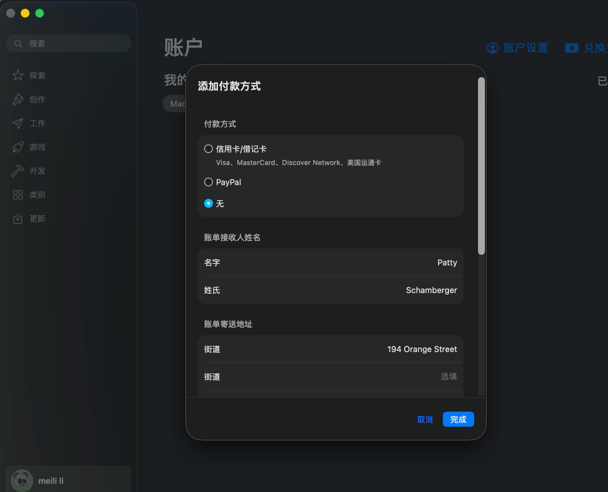

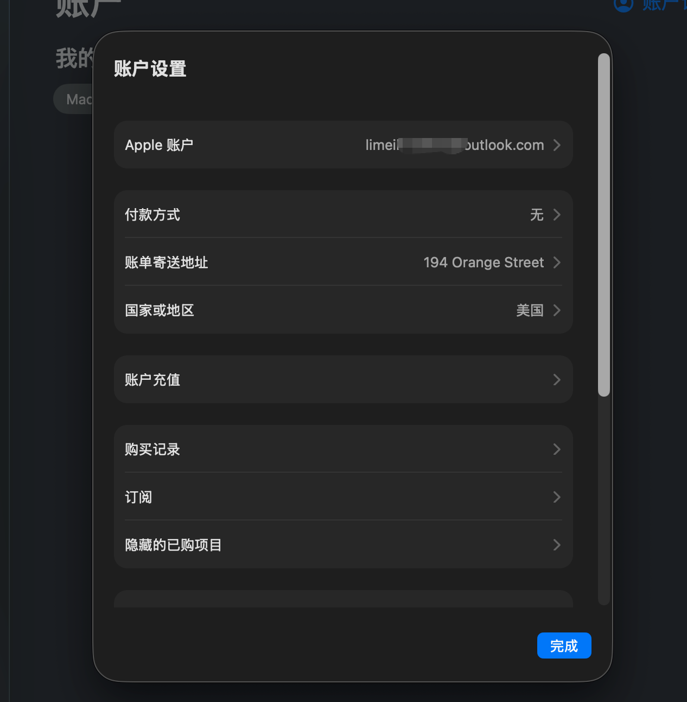

#### 🎉恭喜你，经历了九九八十一难后，终于修改成功了！！！

### 6、购买礼品卡

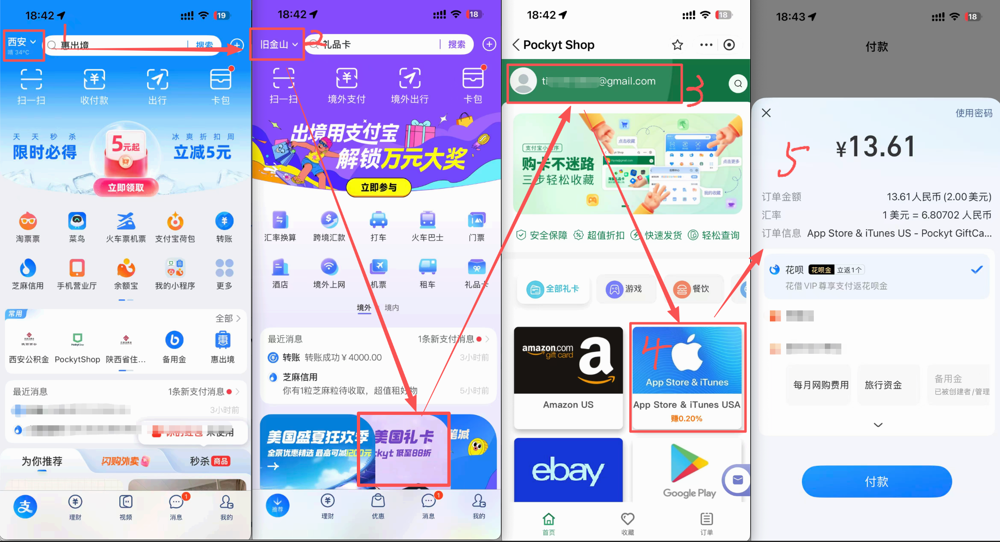

1. 支付宝左上角切换地址为旧金山
2. 点击美国礼品卡
3. 登录 pocketShop （用一个能接收礼品卡信息的国外邮箱就行 gmail 或 outlook）
4. 支付

### 7、在邮箱中查看购买后的礼品卡

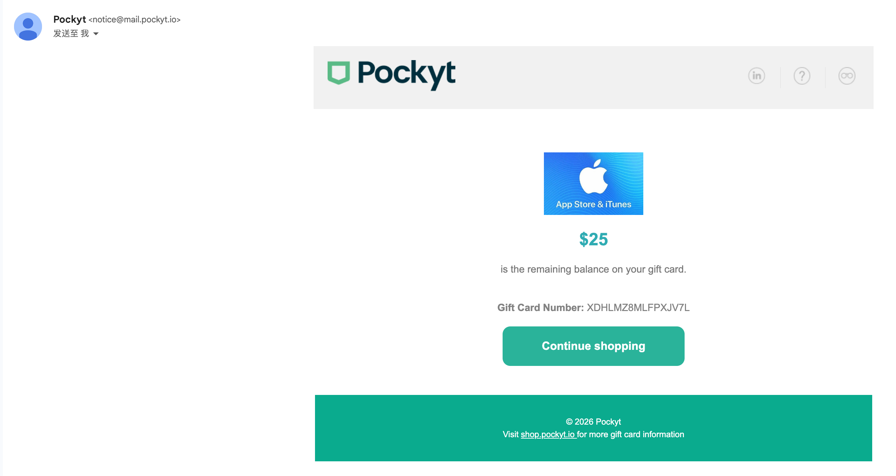

### 8、 将礼品卡充值到美区的Appid账户中

1. 在手机端打开App Store，点击头像 - 登录美区ID的账号
2. 点击兑换代码 - 手动输入兑换码 - 输入对应的礼品卡编码
3. 确认余额到账

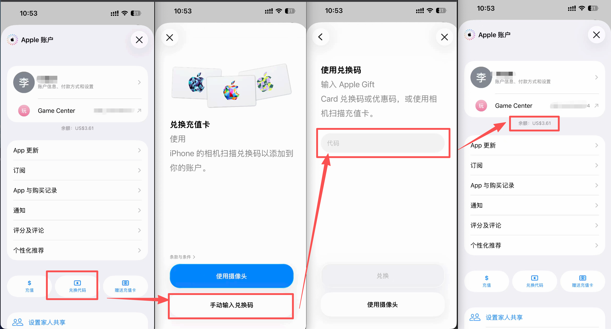

### 9、 手机下载chatGPT - 充值

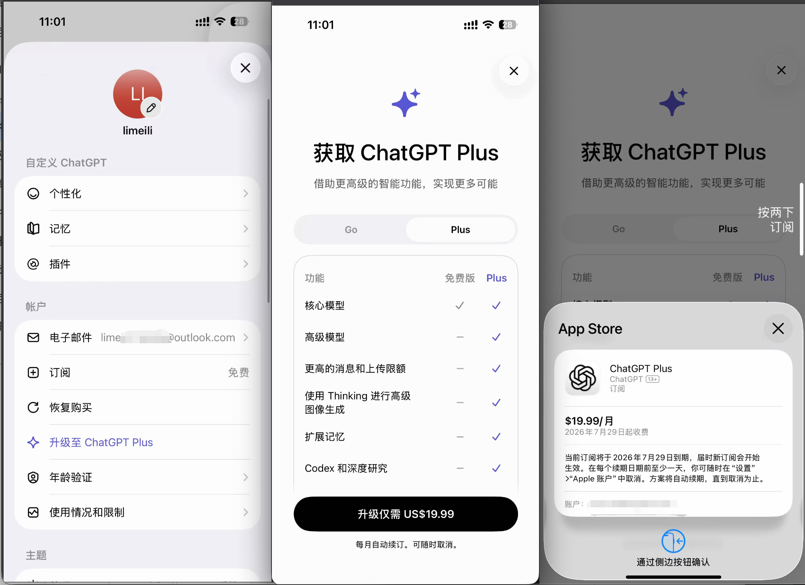

## ⚠️注意事项 
 1.  充值完成后，web端如果还没有显示会员，需清除浏览器缓存
 2.  一个APPID只能绑定一个chatGPT账号，如果绑定多个账号，请使用多个APPID
